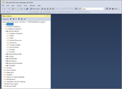
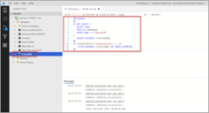
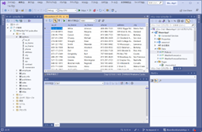
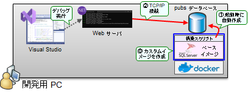
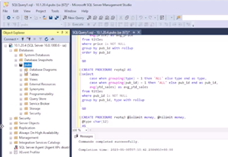

# テスト用 pubs データベースの作成方法について

## pubs データベースとは

SQL Server 2000 に添付されていたサンプルデータベースで、出版社のデータを模倣した、シンプルな構造を持つデータベースです。Northwind データベースや Adventure データベースなどと同様、簡単なテスト用のデータベースとして利用されていました。現在は GitHub 上にて[インストールスクリプト](https://github.com/microsoft/sql-server-samples/blob/master/samples/databases/northwind-pubs/instpubs.sql)が MIT ライセンスにて公開されています。

  

これらのデータベースは非常にシンプルなため、現在でも便利に利用できます。セットアップにはこのスクリプトの一部を書き換えて利用します。主な書き換えポイントは以下の 2 つです。

- DB 作成処理を除去（Azure SQL DB に対応できるようにするため）
- authors テーブルにタイムスタンプ列を追加（楽観同時実行制御を用いたデータ更新の例を示すため）

## データベース管理ツールの選択肢

データベースの作成やデータ編集には、何らかのデータベース管理ツールが必要です。SQL Server データベースに直接アクセスしてスキーマやデータを確認するためのツールとしては以下があります。いずれを利用しても構いませんが、以前から SQL Server をお使いの方であれば SSMS を、新規に利用される方であれば Azure Data Studio をご利用いただくとよいと思います。

- SSMS (SQL Server Management Studio)
- ADS (Azure Data Studio)
- VS Data Explorer (Visual Studio)

1. SSMS (SQL Server Management Studio)\
昔からある SQL Server の管理ツールです。SQL Server のフルセットの管理機能が提供されますが、Windows マシンでのみ利用可能です。[ここ](https://learn.microsoft.com/ja-jp/sql/ssms/download-sql-server-management-studio-ssms)からダウンロードできます。\
  

2. ADS (Azure Data Studio)\
Windows, Linux, macOS などのマルチ OS に対応した新しい管理ツールです。近代的な開発に対応しており、ソースコードコントロール対応、Jupiter Notebook 統合などがサポートされています。[ここ](https://learn.microsoft.com/ja-jp/sql/azure-data-studio/download-azure-data-studio)からダウンロードできます。\
  

3. VS Data Explorer (Visual Studio)\
Visual Studio にはデータエクスプローラと呼ばれる機能が含まれており、これを用いて SQL Server の簡易な管理ができます。中身は SSMS から開発に必要となる基本的なデータ操作機能を切り出したもの、と考えるとよいでしょう。Visual Studio を利用している場合にはこのツールで済ませてしまってもよいと思います。\
  

## テスト用のデータベースサーバ作成の選択肢

また、開発用のデータベースサーバを立てる必要がありますが、手軽に SQL Server を立てる主な方法としては以下のようなものがあります。（他にも SQL Server Express Edition などいくつかの選択肢がありますが、ここでは以下の 4 つをご紹介することにします。）

1. ローカルマシンに SQL Server を立てる\
開発者向け SQL Server である Developer Edition をローカルマシンにインストールして利用する方法です。以前から SQL Server を使われている方には最も馴染みのある方法だと思います。\
  

2. SQL Server の Docker イメージを利用する\
Linux 版 SQL Server はインストール済み Docker イメージが配布されています。これを利用すると簡単に SQL Server が立てられます。\
  

3. カスタム Docker イメージを作成・利用する\
前述の方法も便利ですが、この方法だと、コンテナを削除して作り直すと、また改めて SQL Server のクリーンインストールイメージにサンプル DB をセットアップし直す必要が生じます。このため Dockerfile を利用して、このセットアップ処理を自動化してしまう、という方法もあります。\
  

4. Azure SQL Database を利用する\
最後に、Azure サブスクリプションを持っている場合には、そこに SQL データベースを立てておくと便利です。最も小さいサイズで作成しておけば、課金も少なくて済みます。筆者は複数のサンプルアプリから同一の DB を利用するため、主にこの方法を使っています。\
 

以降では、各方法でデータベースをセットアップする方法を解説します。

## 1. ローカルマシンに SQL Server を立てる

  

SQL Server には、開発・テスト用途として無償で利用できる、開発者エディション（Developer Edition）と呼ばれるものがあります。これをローカルマシンにインストールして利用することができます。以下に具体的な方法を示します。

### セットアップ方法

- [ここ](https://www.microsoft.com/ja-jp/sql-server/sql-server-downloads)から SQL Server Developer Edition のインストーラを入手します。
- インストーラ起動後、「メディアのダウンロード」を選択すると、ISO メディアをダウンロードできます。\
  
- ダウンロードした ISO をマウントし、管理者コマンドラインから以下のコマンドでセットアップしてください。（パスワード SAPWD は複雑なものが必要なため、適宜変更してください。またローカル管理者アカウント SQLSYSADMINACCOUNTS の名前は Administrator 以外の場合もありますのでこちらも適宜変更してください。）
```
setup.exe /Q /IACCEPTSQLSERVERLICENSETERMS /ACTION="install" /FEATURES=SQL,Tools /INSTANCENAME=MSSQLSERVER /SECURITYMODE=SQL /SAPWD=“XXXXXXXX" /SQLSVCACCOUNT="NT AUTHORITY\NETWORK SERVICE" /SQLSVCSTARTUPTYPE="Automatic" /SQLSYSADMINACCOUNTS=".\Administrator"
```

### データ準備方法

- ローカルマシンにインストールした SQL Server に対して、SSMS や ADS などのツールから接続します。主な設定項目は以下の通りです。
  - サーバ名 : localhost
  - ユーザ名 : sa
  - パスワード : セットアップ時の指定値
  - サーバ証明書を信頼する : はい
- 接続後、サーバを右クリックし、新規 DB を作成します。
  - データベース名 : pubs
- 作成した DB を選択し、「新しいクエリ」を選択します。
- 接続先 DB が “pubs” になっていることを確認した上で、インストールスクリプト（”pubs_azure_with_timestamp.txt”）の中身を貼り付けて実行してください。\
  

### アプリからの接続

- 以下の接続文字列を書き換えて利用してください。
  - 主な書き換え場所はパスワードです。
  - TrustServerCertificate が True に設定されていることを確認してください。（localhost でアクセスを行う＝サーバ名を使っていないため、そのままではサーバの証明書が信頼できないためです）
- 既定のインストールでは名前付きパイプ接続のみが有効です。このためこの SQL Server に対してリモートマシンから接続したい場合には、追加で以下 2 つの作業を行ってください。
  - SQL Server サービスマネージャから TCP 接続を有効化
  - 当該マシンのファイアウォール設定を変更し、1433 ポートへの着信を許可

``` web.config の設定例
<add name="PubsConnection" providerName="System.Data.SqlClient" connectionString="Server=localhost;Initial Catalog=pubs;Persist Security Info=False;User ID=sa;Password=XXXXXXXX;MultipleActiveResultSets=False;Encrypt=True;TrustServerCertificate=True;ConnectRetryCount=3;ConnectRetryInterval=30;Connection Timeout=60;Language=Japanese;" />
```

``` ユーザシークレットの設定例
{
  "ConnectionStrings": {
    "PubsDbContext": "Server=localhost;Initial Catalog=pubs;Persist Security Info=False;User ID=sa;Password=XXXXXXXX;MultipleActiveResultSets=False;Encrypt=True;TrustServerCertificate=True;Connection Timeout=30;"
  }
}
```

## 2. SQL Server の Docker イメージを利用する\

  

Linux 版 SQL Server はインストール済み Docker イメージが配布されています。これを利用すると簡単に SQL Server が立てられます。

### セットアップ方法

- Docker Desktop などを利用し、自マシン内に Docker をインストールします。(WSL2 をインストールしてその中に Docker を立てる方法でも構いません。)
- SQL Server のイメージを pull して実行します。実行の際、いくつかの環境変数を設定します。
  - MSSQL_PID=Developer　これにより Developer Edition 相当として利用することができます。
  - MSSQL_SA_PASSWORD=XXXXXXXX　ここには適切・複雑なパスワードを設定してください。

```
sudo docker pull mcr.microsoft.com/mssql/server:2022-latest

sudo docker run -e "ACCEPT_EULA=Y" -e "MSSQL_SA_PASSWORD=XXXXXXXX" -e "MSSQL_PID=Developer" -e "MSSQL_TCP_PORT=1433" -p 1433:1433 --name sqlcontainer --hostname sqlserver -d mcr.microsoft.com/mssql/server:2022-latest
```

- 起動後、docker ps -la でコンテナが正しく起動していることを確認してください。

```
$ docker ps -la
CONTAINER ID   IMAGE                                        COMMAND                  CREATED         STATUS         PORTS                                       NAMES
0bb86ab1ef97   mcr.microsoft.com/mssql/server:2022-latest   "/opt/mssql/bin/perm…"   4 seconds ago   Up 3 seconds   0.0.0.0:1433->1433/tcp, :::1433->1433/tcp   sqlcontainer
```

### 


